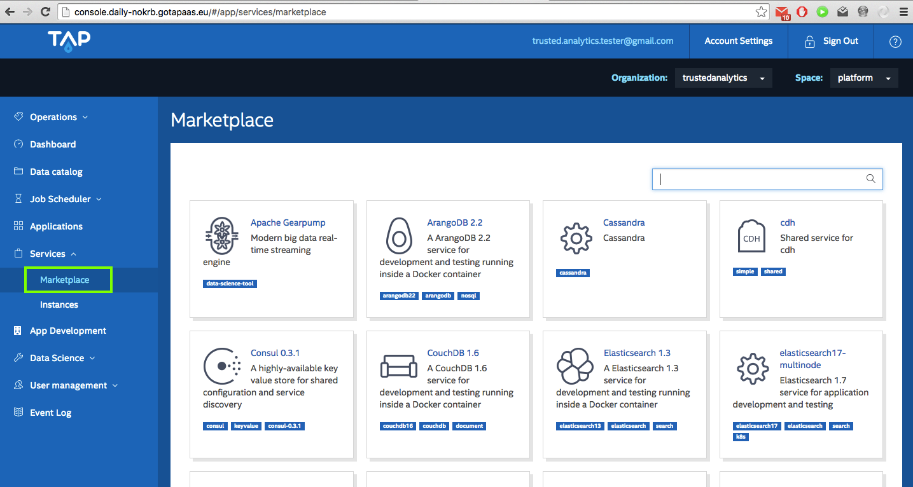
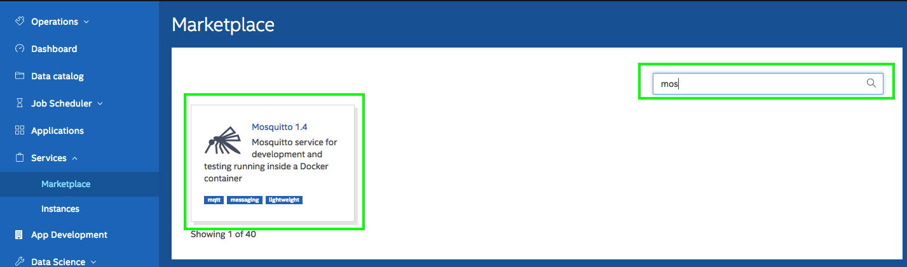
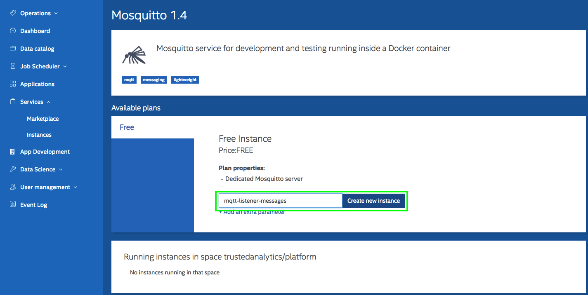
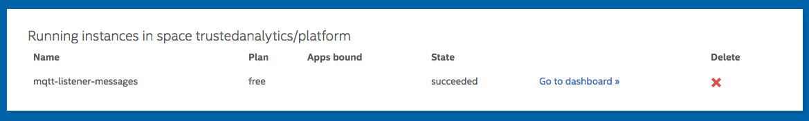
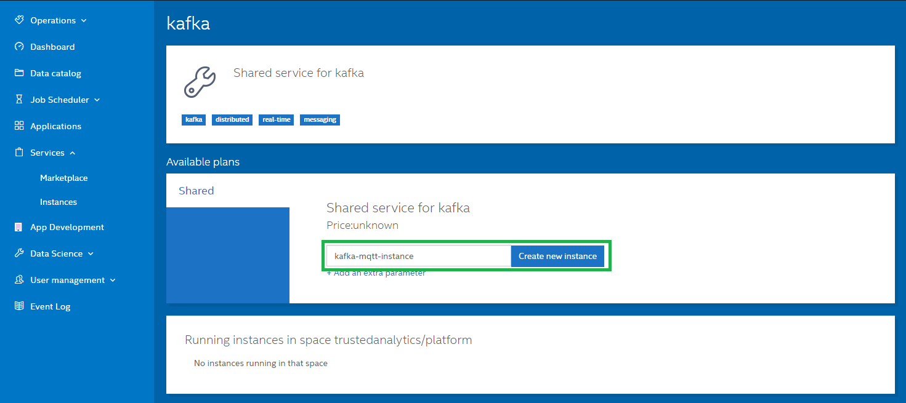

Developing MQTT application on Trusted Analytics Platform is no different from "normal" development of such an app.
 
The code is in general the same. TAP systematizes the way an application obtains credentials to services it needs to use.
The term for this is "service binging". This section explains how to create one in TAP and how the application can use it.
#Manual deployment

## Creating services 
#### Mosquito instance
Services available in TAP are presented in TAP's console Marketplace.
Go to the marketplace:

and select your organization and space.


Find Mosquitto and click on its icon:



Give the instance a name and click `Create new instance` button:



> This example assumes the service is called `mqtt-listener-messages`. The name is used in `application.yml`. Update the config file if needed.

Now, you should have a mqtt service instance provisioned for you:


#### Kafka instance
Procedure to install Kafka is the same as installing Mosquito.   

1. Select Marketplace from menu
2. Find Kafka and click on its icon
3. Give the instance a name and click `Create new instance` button:  



> This example assumes the service is called `kafka-mqtt-instance`. The name is used in `application.yml`. Update the config file if needed.
 
## Binding the service to the app
There are several ways to indicate that given app should use certain service. 
When you have an app deployed, you could find it in `Applications` section (in TAP's console), display the details (`See details`) and use `Bindings` tab. Alternatively, you could do this using CLI. 

In this example we are using manifest file.


Manifests are the wey yhe platform let's you declare what you want to have when deploying the app. The project contains example manifest ([src/cloudfoundry/manifest.yml](../src/cloudfoundry/manifest.yml)):

 

```
applications:
- name: mqtt-listener
  memory: 512M
  host: mqtt-listener
  path: target/mqtt-listener-example-${version}.jar
  services:
  - mqtt-listener-messages
  - kafka-mqtt-instance
  env:
    VERSION: ${version}
    KAFKA_TOPIC: mqtt-listener-topic
    MQTT_TOPIC: mqtt-listener/test-data
    MQTT_CNAME: mqtt-listener
``` 

In our case you see we wanted 512MB of memory for the app, named it mqtt-listener and showed that the app should use `mqtt-listener-messages` service.

## Deploying the application
In order to deploy the application on TAP you first need to build the project:

```mvn clean package```
    
This produces jar file in target directory of the project. The name of the file is going to be mqtt-listener-${version}.jar, 
where ${version} is current project version (see [`version` property of pom.xml](../pom.xml)).

To deploy, you can use the CLI:

    cf push
    
It assumes you are logged in (cf login), and the current directory is the project root dir. This way `cf push` uses manifest.yml that contains all required information.

# Automated deployment
* Switch to `deploy` directory: `cd deploy`
* Install tox: `sudo -E pip install --upgrade tox`
* Run: `tox`
* Activate virtualenv with installed dependencies: `. .tox/py27/bin/activate`
* Run deployment script: `python deploy.py` providing required parameters when running script (`python deploy.py -h` to check script parameters with their descriptions).

# [Optional] Verifying Mosquitto service metadata
After the service has been bound to the app, and the app is running, you may want to verify the metadata associated with the service.

It can be done with CLI:

    cf env mqtt-listener

or from TAP's console (go to Services->instances and create and export a service key for that instance).

Visit [How to access the credentials in the app](Mosquitto-service-credentials.md) to check the description of the data.

